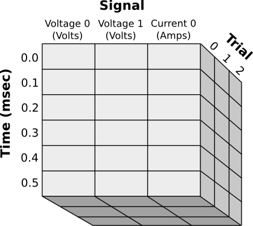

MetaArray
=========

MetaArray is a class that extends ndarray, adding support for per-axis
metadata storage. This class is useful for storing data arrays along
with units, axis names, column names, axis values, etc. MetaArray
objects can be indexed and sliced arbitrarily using named axes and
columns.

Example Uses
------------

Here is an example of the type of data one might store with MetaArray:



Notice that each axis is named and can store different types of meta
information: \\* The Signal axis has named columns with different units
for each column \\* The Time axis associates a numerical value with each
row \\* The Trial axis uses normal integer indexes

Data from this array can be accessed many ways:

```python
data[0, 1, 1]
data[:, "Voltage 1", 0]
data["Trial": 1, "Signal": "Voltage 0"]
data["Time": slice(3,7)]
```

Features
--------

* Per axis meta-information:
  * Named axes
  * Numerical values with units (e.g., "Time" axis above)
  * Column names/units (e.g., "Signal" axis above)
* Indexing by name:
  * Index each axis by name, so there is no need to remember order of axes
  * Within an axis, index each column by name, so there is no need to remember the order of columns
* Read/write files easily
* Append, extend, and sort convenience functions

Documentation
-------------

### Instantiation

Accepted Syntaxes:

```python
# Constructs MetaArray from a preexisting ndarray and info list
MetaArray(ndarray, info)

 # Constructs MetaArray using empty(shape, dtype=type) and info list
MetaArray((shape), dtype=type, info)

 # Constructs MetaArray from file written using MetaArray.write()
MetaArray(file='fileName')
```

`info` parameter: This parameter specifies the entire set of metadata for this MetaArray and must follow a specific format. First, info is a list of axis descriptions:`

```python
info=[axis1, axis2, axis3, ...]
```

Each axis description is a dict which may contain:
  * "name": the name of the axis
  * "values": a list or 1D ndarray of values, one per index in the axis
  * "cols": a list of column descriptions `[col1, col2, col3, ...]`
  * "units": the units associated with the numbers listed in "values"

All of these parameters are optional. A column description, likewise, is a dict which may contain:
  * "name": the name of the column
  * "units": the units for all values under this column

In the case where meta information is to apply to the entire array, (for example, if the entire array uses the same units) simply add an extra axis description to the end of the info list. All dicts may contain any extra information you want.

For example, the data set shown above would look like:

```python
MetaArray((3, 6, 3), dtype=float, info=[
    {"name": "Signal", "cols": [
        {"name": "Voltage 0", "units": "V"},
        {"name": "Voltage 1", "units": "V"},
        {"name": "Current 0", "units": "A"}
      ]
    },
    {"name": "Time", "units": "msec", "values":[0.0, 0.1, 0.2, 0.3, 0.4, 0.5] },
    {"name": "Trial"},
    {"note": "Just some extra info"}
  ]
```
### Accessing Data

Data can be accessed through a variety of methods: \\* Standard
indexing--You may always just index the array exactly as you would any
ndarray \\* Named axes--If you don't remember the order of axes, you may
specify the axis to be indexed or sliced like this:

```python
data["AxisName": index]
data["AxisName": slice(...)]
```
Note that since this syntax hijacks the original slice mechanism, you must specify a slice using slice() if you want to use named axes.
* Column selection--If you don't remember the index of a column you wish to select, you may substitute the column's name for the index number. Lists of column names are also acceptable. For example:

```python
data["AxisName": "ColumnName"]
data["ColumnName"]  ## Works only if the named column exists for this axis
data[["ColumnName1", "ColumnName2"]]
```

* Boolean selection--works as you might normally expect, for example:

```python
sel = data["ColumnName", 0, 0] > 0.2
data[sel]
```

* Access axis values using MetaArray.axisValues(), or .xvals() for short. 
* Access axis units using .axisUnits(), column units using .columnUnits()
* Access any other parameter directly through the info list with .infoCopy()

### File I/O

```python
data.write('fileName')
newData = MetaArray(file='fileName')
```

### Performance Tips

MetaArray is a subclass of ndarray which overrides the
`__getitem__` and `__setitem__` methods. Since these methods
must alter the structure of the meta information for each access, they
are quite slow compared to the native methods. As a result, many builtin
functions will run very slowly when operating on a MetaArray. It is
recommended, therefore, that you recast your arrays before performing
these operations like this:

```python
data = MetaArray(...)
data.mean()                ## Very slow
data.view(ndarray).mean()  ## native speed
```

### More Examples

A 2D array of altitude values for a topographical map might look like

```python
info=[
    {'name': 'lat', 'title': 'Latitude'}, 
    {'name': 'lon', 'title': 'Longitude'}, 
    {'title': 'Altitude', 'units': 'm'}
]
```

In this case, every value in the array represents the altitude in feet at the lat, lon
position represented by the array index. All of the following return the 
value at lat=10, lon=5:

```python
array[10, 5]
array['lon': 5, 'lat': 10]
array['lat': 10][5]
```

Now suppose we want to combine this data with another array of equal dimensions that
represents the average rainfall for each location. We could easily store these as two 
separate arrays or combine them into a 3D array with this description:

```python
info = [
    {
        'name': 'vals',
        'cols': [
            {'name': 'altitude', 'units': 'm'},
            {'name': 'rainfall', 'units': 'cm/year'},
        ],
    },
    {'name': 'lat', 'title': 'Latitude'},
    {'name': 'lon', 'title': 'Longitude'},
]
```

We can now access the altitude values with `array[0]` or `array['altitude']`, and the
rainfall values with `array[1]` or `array['rainfall']`. All of the following return
the rainfall value at lat=10, lon=5:

```python
array[1, 10, 5]
array['lon': 5, 'lat': 10, 'val': 'rainfall']
array['rainfall', 'lon': 5, 'lat': 10]
```

Notice that in the second example, there is no need for an extra (4th) axis description
since the actual values are described (name and units) in the column info for the first axis.

Contact
---------
Luke Campagnola - `[firstname][lastname]@gmail.com`
